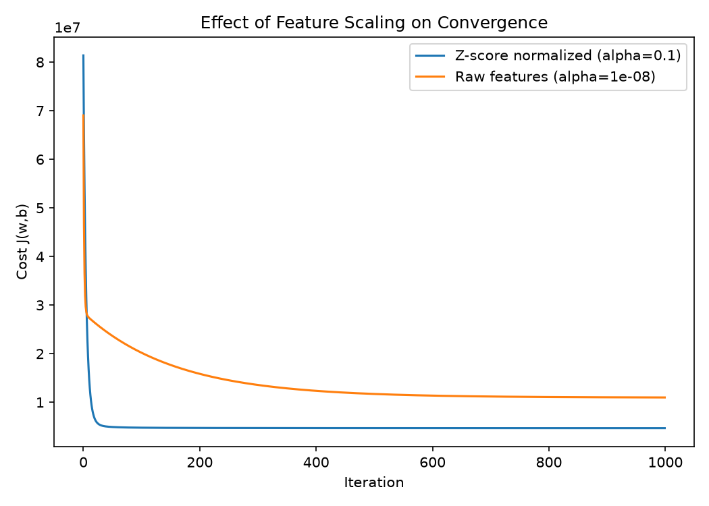
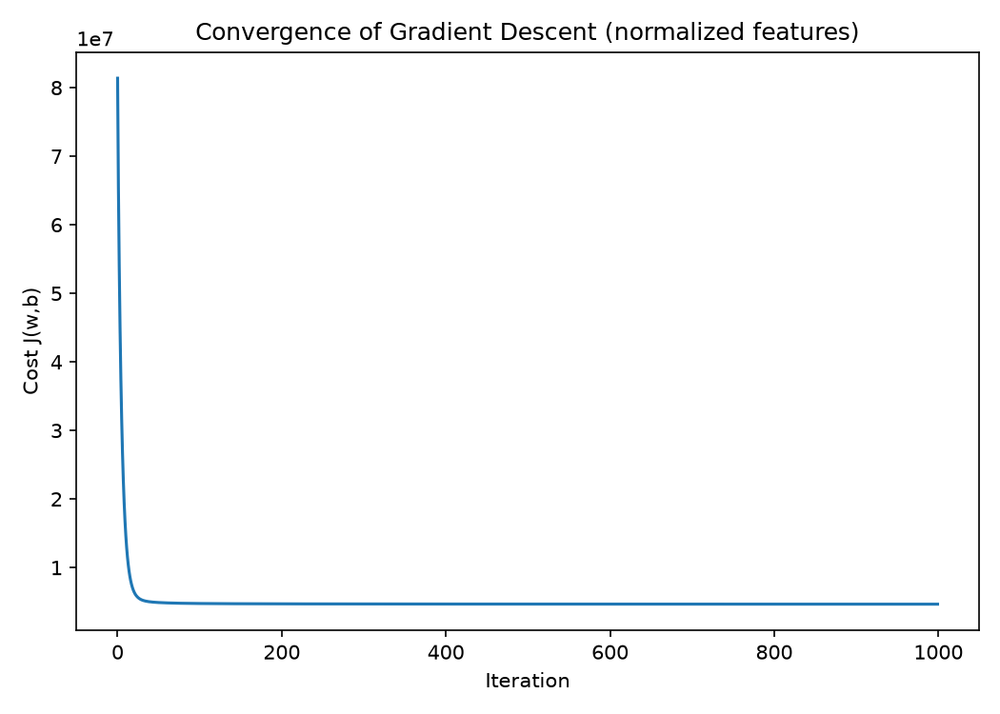
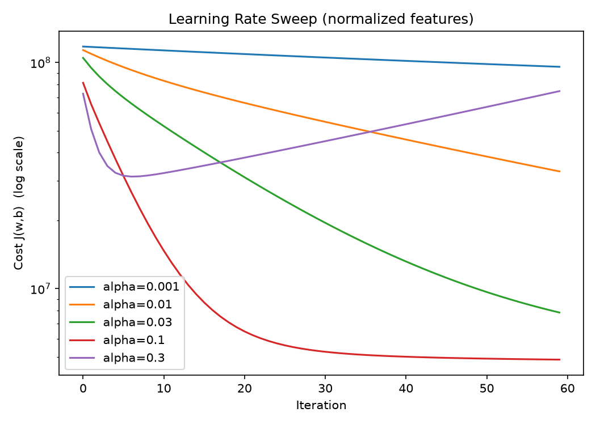
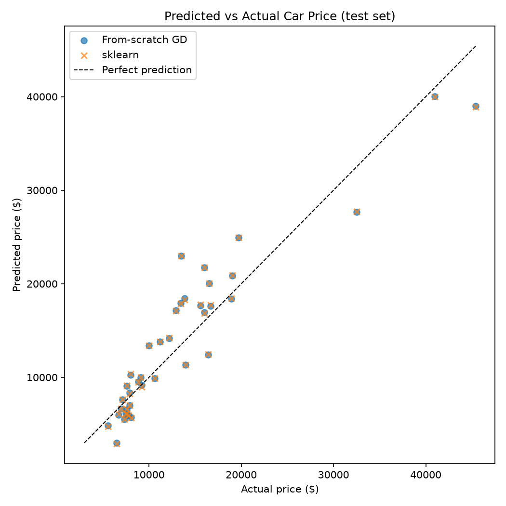

# Car Price Prediction — Linear Regression From Scratch

Predicts used car prices from a car's specifications (engine size, curb
weight, horsepower, mileage, etc.) using **multivariate linear regression
trained with batch gradient descent, implemented from scratch in numpy**
(no `sklearn.linear_model` in the training loop itself — sklearn is only
used afterwards as a sanity-check baseline).

This project applies: cost function derivation, vectorized gradient
descent, multiple features, and z-score normalization.

## Dataset

[UCI Machine Learning Repository — 1985 Auto Imports Database](https://archive.ics.uci.edu/ml/machine-learning-databases/autos/imports-85.data)
(205 rows, real 1985 model-year car specs and prices).

13 continuous numeric features are used as predictors:
`wheel_base, length, width, height, curb_weight, engine_size, bore,
stroke, compression_ratio, horsepower, peak_rpm, city_mpg, highway_mpg`.
Rows with missing values (`?` in the raw data) are dropped.

## Project structure

```
carprices/
├── data/
│   ├── imports-85.data      # raw dataset
│   └── clean_auto.csv       # cleaned dataset (generated)
├── src/
│   ├── data_prep.py         # load + clean the raw data
│   ├── linear_regression.py # cost, gradient, gradient descent, z-score norm
│   └── train.py             # train, evaluate, plot, compare to sklearn
├── plots/                   # generated convergence / prediction plots
└── requirements.txt
```

## The math

Model:

```
f(x) = w · x + b
```

Cost function (mean squared error):

```
J(w, b) = (1 / 2m) * Σ (f(x_i) - y_i)²
```

Gradients:

```
∂J/∂w_j = (1/m) * Σ (f(x_i) - y_i) * x_i_j
∂J/∂b   = (1/m) * Σ (f(x_i) - y_i)
```

Update rule (repeated until convergence):

```
w_j := w_j - α * ∂J/∂w_j
b   := b   - α * ∂J/∂b
```

Features are z-score normalized before training:

```
x_norm = (x - μ) / σ
```

The training set's `μ`/`σ` are reused to scale the test set (fit on
train, transform on train and test) so the test set can't leak into the
model.

## How to run

```bash
python -m venv venv
venv\Scripts\activate        # Windows
pip install -r requirements.txt

python src/data_prep.py      # cleans data/imports-85.data -> data/clean_auto.csv
python src/train.py          # trains, evaluates, saves plots/
```

## Results

Trained on 80% of the data (test set held out), evaluated on the
remaining 20%.

| Model            | RMSE | R² |
|-------------------|------|-----|
| From-scratch gradient descent | $3,136 | 0.8695 |
| sklearn `LinearRegression`    | $3,140 | 0.8692 |

The from-scratch implementation matches sklearn's closed-form/optimized
result closely, confirming the gradient descent implementation is
correct.

### Why normalization matters



Without z-score normalization, gradient descent needs a learning rate
several orders of magnitude smaller to avoid diverging (features like
`curb_weight` are in the thousands while `bore` is ~3), and converges far
slower even then. Normalizing puts every feature on the same scale, so a
single learning rate works well and convergence is much faster.

### Convergence



### Choosing a learning rate



Sweeping alpha on the normalized features (log-scale y-axis) shows the
three regimes: `0.001`/`0.01` are too small and barely move in 60
iterations; `0.1` converges quickly and smoothly; `0.3` overshoots the
minimum, and after a brief dip the cost turns around and diverges. This
is why `alpha=0.1` is used for training above.

### Predicted vs actual price



## Key takeaways

- Implementing gradient descent by hand (vectorized with numpy, not
  Python loops over examples) makes the mechanics of the cost function
  and gradients concrete rather than a black box.
- Feature scaling isn't just a nice-to-have — it materially changes
  what learning rates are even usable and how fast the model converges.
- Splitting-then-normalizing (fit scaler on train only) matters to
  avoid leaking test-set information into training.
